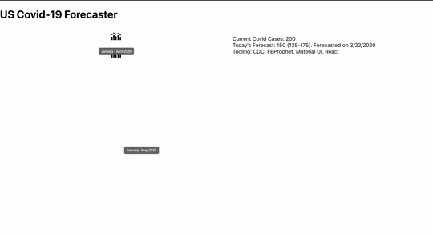

# Covid-19-UI
UI showing the covid 19 forecast and current cases.

This project uses the forecasts build in [Covid 19 ML Insights Repo](https://github.com/Abiaina/Covid-19-ML-Insights)

## Script

To run locally, from the project root directory run: `npm start`  .
Open [http://localhost:3000](http://localhost:3000) to view it in the browser.

